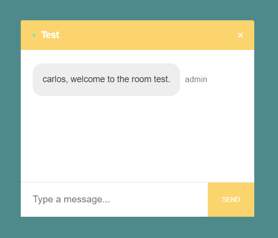

# ChatApp
Application to chat with several at the same time, in real time and in mobile version.

# Join - App
In the join, you must enter the name of the user and the name of the room where you enter the chat and clicking on it redirects you to the room you have created.

  

# Room - Chat
The room shows you the name with which you accessed and also the name of the user with a welcome message that it gives when accessing.

  

