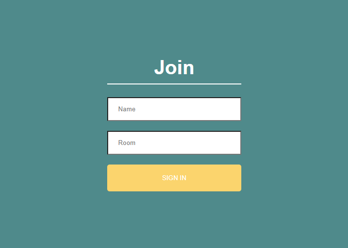

# ChatApp
Application to chat with several at the same time, in real time and in mobile version.

# Join - App
In the join, you must enter the name of the user and the name of the room where you enter the chat and clicking on it redirects you to the room you have created.

  

# Room - Chat
The room shows you the name with which you accessed and also the name of the user with a welcome message that it gives when accessing.

  

# Users - Online
Technological stack of the app and users that are connected in the room.

  

# Conversation between users
Communication between users of the same room in a bidirectional way using socket as a link between server and client.

  

# Connection/Disconnection
The app warns by means of a message when a new user connects as well as when disconnecting.

  

